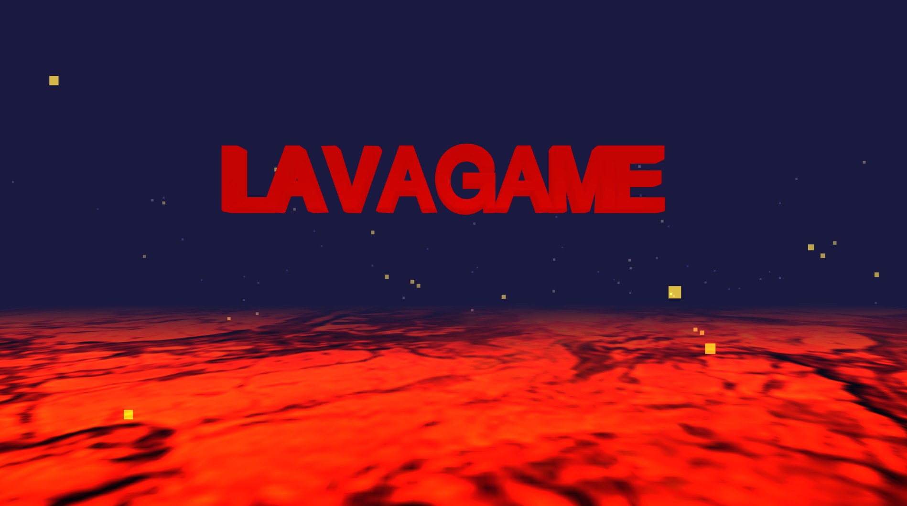

# Floor is Lava
This is an interactive game based on the classic game "The floor is lava". 

The objective is to jump from box to box without falling to the ground, while the lava rises and threatens to take over the entire environment. 

The game was developed using the Three.js library to render 3D graphics and create an immersive experience.

## Technologies Used
Three.js: JavaScript library for in-browser 3D rendering.

HTML5 and CSS3: For structuring and styling the web page.

JavaScript: Game operating logic and user interaction.

## How to Play
Use the arrow keys or space keys to jump from box to box.

Avoid falling to the ground, as lava will rise every moment.

The game ends when you fall into the lava!
